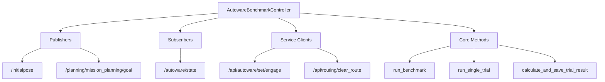

# Autoware Benchmark Controller

[](https://docs.ros.org/en/humble/)
[](https://www.python.org/)

> **자동화된 Autoware 자율주행 반복 측정 시스템**  
> 설정된 경로에서 반복 테스트를 수행하여 자율주행 시스템의 성능과 안정성을 정량적으로 평가합니다.

## 목차

- [개요](#개요)
- [주요 기능](#주요-기능)
- [시스템 아키텍처](#시스템-아키텍처)
- [설치 및 사용법](#설치-및-사용법)
- [ROS2 인터페이스](#ros2-인터페이스)
- [결과 분석](#결과-분석)

## 개요

Autoware의 자율주행 성능을 자동화된 방식으로 측정하는 시스템입니다. 

**핵심 목표:**
- **자동화된 반복 테스트**: 수동 개입 없이 대량의 테스트 실행
- **정량적 성능 측정**: 성공률, 평균 주행시간 등 객관적 지표 제공  
- **시스템 안정성 평가**: 다양한 조건에서의 robust성 검증
- **성능 추적**: 시스템 개선사항의 효과 측정

## 주요 기능

### 자동화된 테스트 실행
- **포즈 설정**: 초기 위치 → 목표 위치 자동 설정
- **자율주행 제어**: Engage/Disengage 자동 관리
- **상태 모니터링**: 실시간 Autoware 상태 추적
- **완료 감지**: 목표 도달 자동 감지

### 반복 테스트 관리
- **사용자 정의 횟수**: 기본 100회, 커스터마이징 가능
- **자동 복구**: 실패 시 3단계 복구 메커니즘
- **상태 초기화**: 각 테스트 간 완전한 시스템 리셋
- **타임아웃 관리**: 설정 가능한 최대 실행 시간

### 성능 측정 및 분석
- **이중 시간 측정**: 전체 테스트 시간 + 실제 주행 시간
- **성공률 계산**: 실시간 성공/실패 통계
- **CSV 결과 저장**: 상세 로그 및 요약 통계
- **실시간 모니터링**: 진행 상황 콘솔 출력

## 시스템 아키텍처



### 핵심 컴포넌트

| 컴포넌트 | 역할 | 설명 |
|---------|------|------|
| **Publishers** | 차량 제어 | Initial/Goal pose 전송 |
| **Subscribers** | 상태 모니터링 | Autoware 상태 실시간 추적 |
| **Service Clients** | 시스템 제어 | Engage/Route 관리 |
| **Core Methods** | 테스트 로직 | 벤치마크 실행 및 결과 처리 |

## 설치 및 사용법

### 전제 조건
> **Autoware-tools는 이미 설치되어 있다고 가정하고 진행합니다**

- ROS2 Humble
- Python 3.8+
- Autoware 실행 환경

### 빠른 시작

#### 1. 환경 설정
```bash
# Autoware 환경 소싱
source ~/autoware-1/install/setup.bash

# 패키지 빌드 (필요시)
cd ~/autoware-1
colcon build --packages-select my_package
source install/setup.bash
```

#### 2. 기본 실행
```bash
# 기본 설정 (100회 테스트, 300초 타임아웃)
ros2 run my_package autoware_loop_node
```

#### 3. 커스텀 실행
```bash
# 50회 테스트, 600초 타임아웃
ros2 run my_package autoware_loop_node --ros-args \
  -p trial_count:=50 \
  -p timeout_seconds:=600.0

# 빠른 테스트 (10회, 120초)
ros2 run my_package autoware_loop_node --ros-args \
  -p trial_count:=10 \
  -p timeout_seconds:=120.0
```

### 셸 스크립트 실행

```bash
# 실행 권한 부여 (최초 1회)
chmod +x ~/autoware-1/run_benchmark_with_logs.sh

# 벤치마크 실행 (Autoware 자동 시작 + 로그 저장)
~/autoware-1/run_benchmark_with_logs.sh
```

**스크립트 기능:**
- Autoware 백그라운드 자동 실행
- 벤치마크 자동 시작
- 로그 파일 자동 저장
- 완료 후 정리 작업

### 결과 파일 위치
```bash
# CSV 결과 파일
~/autoware_logs/driving_benchmark_results.csv

# Autoware 실행 로그 (스크립트 사용시)
~/autoware_logs/autoware_run.log
```

## ROS2 인터페이스

### Publishers

#### `/initialpose` - Initial Pose
```yaml
# geometry_msgs/msg/PoseWithCovarianceStamped
Header header
  Time stamp
  string frame_id: "map"
PoseWithCovariance pose
  Pose pose
    Point position: {x: 6747.93, y: 60173.98, z: 0.0}
    Quaternion orientation: {x: 0.0, y: 0.0, z: 0.719, w: 0.695}
  float64[36] covariance  # 위치 불확실성
```

#### `/planning/mission_planning/goal` - Goal Pose
```yaml
# geometry_msgs/msg/PoseStamped  
Header header
  Time stamp
  string frame_id: "map"
Pose pose
  Point position: {x: 6747.75, y: 60135.05, z: 0.0}
  Quaternion orientation: {x: 0.0, y: 0.0, z: 0.690, w: 0.724}
```

### Subscribers

#### `/autoware/state` - Autoware State
```yaml
# autoware_auto_system_msgs/msg/AutowareState
Time stamp
uint8 state

# 상태 코드
INITIALIZING = 1
WAITING_FOR_ROUTE = 2
PLANNING = 3           # ← DRIVING 상태 시작
WAITING_FOR_ENGAGE = 4 # ← DRIVING 상태
DRIVING = 5           # ← DRIVING 상태  
ARRIVED_GOAL = 6      # ← NON-DRIVING (목표 도달)
FINALIZING = 7
```

**목표 도달 감지 로직:**
```python
if was_driving_before and not is_driving_now:
    self.goal_reached.set()  # 목표 도달!
```

### Service Clients

#### `/api/autoware/set/engage` - Engage Control
```yaml
# tier4_external_api_msgs/srv/Engage
# Request
bool engage: true/false

# Response  
ResponseStatus status
  Time stamp
  uint32 code     # SUCCESS = 20000
  string message
```

#### `/api/routing/clear_route` - Route Clear
```yaml
# autoware_adapi_v1_msgs/srv/ClearRoute
# Request (empty)

# Response
ResponseStatus status
  bool success
  int32 code
  string message
```

### 파라미터

| 파라미터 | 타입 | 기본값 | 설명 |
|---------|------|--------|------|
| `trial_count` | int | 100 | 실행할 테스트 횟수 |
| `timeout_seconds` | double | 300.0 | 테스트별 최대 실행 시간 |

## 결과 분석

### CSV 출력 예시

```csv
=== AUTOWARE DRIVING BENCHMARK RESULTS ===
Total trials: 100
Timeout per trial: 300.0 seconds

----------
test 1 start
start time : 162105
finish time : 162533
total time : 000428
actual driving time : 000350
Status: SUCCESS
----------

=== FINAL RESULTS ===
all test finished
success : 85/100
fail : 15/100
success rate : 85.0%
average test time (successful) : 000280
average driving time (successful) : 000220
```

### 주요 성능 지표

| 지표 | 설명 |
|------|------|
| **성공률** | `(성공 테스트 / 전체 테스트) × 100` |
| **평균 테스트 시간** | 성공한 테스트들의 평균 소요 시간 |
| **평균 주행 시간** | engage부터 목표 도달까지 실제 주행 시간 |
| **실패 패턴** | 타임아웃, 서비스 오류, 상태 감지 실패 등 |

### 실시간 로그 모니터링

```bash
# 벤치마크 결과 실시간 확인
tail -f ~/autoware_logs/driving_benchmark_results.csv

# Autoware 로그 확인 (스크립트 사용시)
tail -f ~/autoware_logs/autoware_run.log
```
